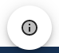

# User guide

## App view

### Components

* New Game button  that generates two new tiles with random values between 2 and 4
* Score panel indicating your current and best score yet  
* Button to toggle sound effects  
* Button to show botton sheet with game information  

* Button to display bottom sheet with various personal links  

* [Game board](game.md)

